### High-Level Overview

**This system is implemented and wired end-to-end (DB → API → web UI → realtime) but has not been load‑ or edge‑case–tested.** Below is a documentation-style walkthrough plus an explicit list of what’s completed vs still pending/risky.

---

### 1. Architecture & Data Model (DB)

**Core idea:** There is **no standalone `queue` table**. The “queue” is the live set of `visits` that are not yet `DONE`, positioned in departments via `currentDepartmentId` and ordered by status/priority.

#### 1.1 Key tables

- **`visits`** (`packages/db/src/schema.ts`)
  - Fields:
    - `id` (UUID PK)
    - `patientId` → `patients.id`
    - `branchId` → `branches.id`
    - `visitTypeId` → `visit_types.id`
    - `ticketNumber` (text, human-facing)
    - `priority` `visit_priority_enum`: `"NORMAL" | "URGENT"` (default `"NORMAL"`)
    - `currentDepartmentId` → `departments.id`
    - `status` `visit_status_enum`: `"WAITING" | "IN_PROGRESS | "DONE" | "ON_HOLD"`
    - `registeredAt`, `completedAt`
  - **Interpretation:** One row = one **visit for the day**, also the unit of queueing.

- **`departments`**
  - `id`, `name`, `code`, `isActive`.
  - `code` drives workflow routing (e.g. `"RECEPTION"`, `"TRIAGE"`, `"DOCTOR"`, `"CASHIER"`).

- **`visit_types`**
  - `id`, `name`
  - `workflowSteps` (JSONB, required): e.g. `["RECEPTION","TRIAGE","DOCTOR","CASHIER"]`
  - `isActive`, optional `baseFee`.
  - **Interpretation:** Defines **which departments** and **in what order** a visit should traverse.

- **`invoices` / `invoice_line_items` / `payments`**
  - `invoices.visitId` → `visits.id`.
  - `status` enum: `"DRAFT" | "ISSUED" | "PAID" | "VOIDED"`.
  - Used to auto-create a draft invoice when a visit starts and to void it on cancellation.

#### 1.2 Seeds / Default workflows

From `[packages/db/src/seeds/workflows.ts]`:

- **Default departments:** `RECEPTION`, `TRIAGE`, `DOCTOR`, `OPTICIAN`, `TECHNICIAN`, `CASHIER`, `DISPATCH`.
- **Default visit types** with `workflowSteps`, e.g.:
  - `"Complete Eye Exam"` → `["RECEPTION","TRIAGE","DOCTOR","OPTICIAN","CASHIER"]`
  - `"Doctor Follow-up"` → `["RECEPTION","TRIAGE","DOCTOR","CASHIER"]`
  - `"Glasses Collection"` → `["RECEPTION","DISPATCH"]`
  - `"Emergency"` → `["RECEPTION","DOCTOR","CASHIER"]`
- The seed function **upserts departments by `code`** and **visit types by `name`**, updating workflows on re-run.

**Claim check (data model):**

- “Queue is a reactive manifestation of active visits” → **True.** `visits` is the only queue representation.
- “visit_types.workflowSteps define ordered department codes” → **True and already seeded.**
- Status and priority enums are present; `ON_HOLD` exists in the enum but is **not yet used anywhere** in queue logic.

---

### 2. Backend Queue Module (`@visyx/api`)

Files:
- `apps/api/src/modules/queue/router.ts`
- `apps/api/src/modules/queue/service.ts`
- `apps/api/src/modules/queue/schemas.ts`

#### 2.1 Schemas

- `GetDepartmentPoolSchema`: `{ branchId: number; departmentCode: string }`
- `StartVisitSchema`:
  - `patientId: string (uuid)`
  - `branchId: number`
  - `visitTypeId: number`
  - `priority: "NORMAL" | "URGENT"` (default `"NORMAL"`)
- `UpdateVisitStatusSchema`: `{ visitId: string (uuid) }`
- `TransferPatientSchema`: `{ visitId: string; targetDepartmentId: number }`

#### 2.2 Router endpoints

All procedures are `protectedProcedure` (auth enforced) and some include permission/audit middleware:

- **Queries**
  - `queue.getVisitTypes`
    - No input.
    - Returns active `visit_types` ordered by `name`.
  - `queue.getDepartmentPool`
    - Input: `GetDepartmentPoolSchema`.
    - Returns **today’s visits** for a branch **in a given department and status `WAITING` only**.
  - `queue.getGlobalOverview`
    - Input: `{ branchId: number }`.
    - Returns **today’s non-`DONE` visits** grouped by department.

- **Mutations**
  - `queue.startVisit` (requires `"queue:manage"`, audited on `"visit"`)
  - `queue.callPatient` (requires `"queue:manage"`, audited w/ `visitId`)
  - `queue.advanceWorkflow` (requires `"queue:manage"`, audited)
  - `queue.transferPatient` (requires `"queue:transfer"`, audited)
  - `queue.markUrgent` (requires `"queue:manage"`, no audit)
  - `queue.cancelVisit` (requires `"queue:cancel"`, audited)

#### 2.3 Service behaviors

##### 2.3.1 Ticket generation

- `generateTicketNumber(branchId)`:
  - Counts existing `visits` for that `branchId` where `DATE(registered_at) = today`.
  - Sets `ticketNumber = (count + 1).toString().padStart(3,"0")` (e.g. `001`, `002`).
- **Risk:** Counting then inserting is **not concurrency-safe**; two concurrent `startVisit` calls for the same branch/day could produce the same ticket number.

##### 2.3.2 `getVisitTypes`

- Simple `SELECT` of `visitTypes` where `isActive = true`; sorted by `name`.
- Used directly by the `StartVisitDialog` dropdown.

##### 2.3.3 `getDepartmentPool`

- Filters:
  - `branchId = input.branchId`
  - `departments.code = input.departmentCode`
  - `visits.status = "WAITING"`
  - `DATE(registered_at) = today`.
- Joins `patients`, `visitTypes`, and `departments`.
- Orders by `priority DESC` then `registeredAt` (so **urgent, then earlier arrivals**).
- Returns nested structures with basic patient and visit type info.

**Implication:** **Only `WAITING` visits show up in `getDepartmentPool`.** Once `callPatient` flips a visit to `IN_PROGRESS`, it **disappears** from the department pool, even though the UI suggests we highlight “serving” patients there.

##### 2.3.4 `getGlobalOverview`

- Filters:
  - `branchId = input.branchId`
  - `status != "DONE"`
  - `DATE(registered_at) = today`.
- Joins `patients` (for `firstName/lastName`) and `departments`.
- Outputs:
  - Visit-level fields: `id`, `ticketNumber`, `status`, `priority`.
  - `patientName` = SQL concat of first+last.
  - `departmentName`, `departmentCode`.
- Results are then **grouped in JS by `departmentCode`** into:
  - `{ name, code, patients: [{ id, ticketNumber, status, priority, patientName }] }[]`.

**Claim check (backend queries):**

- “getDepartmentPool: Fetch active patients in a specific department” → **Implemented**, but **only `WAITING`**; `IN_PROGRESS` never appears in this pool.
- “getGlobalOverview: Group active visits across all departments” → **Implemented exactly as described** (`status != DONE` and grouped by department).
- “getVisitTypes: Returns configuration for starting new visits” → **Implemented and used.**

##### 2.3.5 `startVisit`

- Runs in a DB transaction:
  1. Fetch `visitTypes` row by `visitTypeId`; assert `workflowSteps` present and non-empty.
  2. Get first workflow step: `firstStepCode = steps[0]`, lookup `departments.code = firstStepCode`.
  3. Generate `ticketNumber` for `branchId`.
  4. Insert into `visits`:
     - `patientId`, `branchId`, `visitTypeId`, `ticketNumber`, `priority`, `currentDepartmentId = initialDept.id`, `status = "WAITING"`.
  5. Insert associated `invoices` row:
     - `visitId = newVisit.id`, `totalAmount = 0`, `amountPaid = 0`, `status = "DRAFT"`.

**Claim check:**

- “Instantiates a visit, assigns sequential ticket, sets department to step 0, creates draft invoice” → **Implemented exactly.**

##### 2.3.6 `callPatient`

- Updates `visits`:
  - Sets `status = "IN_PROGRESS"` where `id = visitId AND status = "WAITING"`.
- If no row updated, throws error.
- **Good:** Prevents calling a patient who isn’t currently waiting.

##### 2.3.7 `advanceWorkflow`

- Transaction:
  1. Fetch current visit joined with its `visitTypes.workflowSteps` and current `departments.code`(current department).
  2. Determine `currentIndex = steps.indexOf(currentDeptCode)`.
  3. If `currentIndex === -1` or **already last step**:
     - Set `status = "DONE"` and `completedAt = now`.
     - Return `{ completed: true, visit }`.
  4. Else:
     - Get `nextDeptCode = steps[currentIndex + 1]`.
     - Lookup that department by `code`, ensure exists.
     - Update visit: `currentDepartmentId = nextDept.id`, `status = "WAITING"`.
     - Return `{ completed: false, visit }`.

**Nuances:**

- No check on current `status` (e.g. can “advance” from `WAITING`, `IN_PROGRESS`, or `ON_HOLD` alike).
- The definition of “safe” here is **schema-safe & workflow-consistent**, not concurrency-proof or status‑guarded.

##### 2.3.8 `transferPatient`

- Updates:
  - `currentDepartmentId = targetDepartmentId`
  - `status = "WAITING"`.
- Returns updated visit or throws if not found.
- **No validation** that target department is active or part of the visit’s workflow.

##### 2.3.9 `markUrgent`

- `priority = "URGENT"` for that `visitId`.
- No status/filter guards.

##### 2.3.10 `cancelVisit`

- Transaction:
  1. Update visit to `status = "DONE"`, `completedAt = now`.
  2. Update `invoices` for that `visitId` where `amountPaid = 0` to `status = "VOIDED"`.
- **Claim check:** “Cancels visit and voids draft invoice if unpaid” → **Correct.**

---

### 3. Frontend Queue UX & Realtime (`@visyx/web`)

Key files:

- Realtime hook:  
  `[apps/web/src/app/(dashboard)/dashboard/_hooks/use-queue-subscription.ts]`
- Layout wiring realtime:  
  `[apps/web/src/app/(dashboard)/layout.tsx]`
- Global overview page:  
  `[apps/web/src/app/(dashboard)/dashboard/queue/page.tsx]`
- Department page:  
  `[apps/web/src/app/(dashboard)/dashboard/queue/[id]/page.tsx]`
- Queue UI components:  
  `[apps/web/src/app/(dashboard)/dashboard/queue/_components/queue-department-card.tsx]`  
  `[apps/web/src/app/(dashboard)/dashboard/queue/_components/queue-patient-actions.tsx]`
- Start-visit flow:  
  `[apps/web/src/app/(dashboard)/dashboard/patients/[id]/_components/start-visit-dialog.tsx]`  
  `[apps/web/src/app/(dashboard)/dashboard/patients/[id]/page.tsx]`

#### 3.1 Realtime subscription (`useQueueSubscription`)

- In `DashboardLayout`, `useQueueSubscription()` is called once at the layout level.
- The hook:
  - Gets `branchId` from `useBranch()`.
  - Creates a Supabase client and subscribes:

    - Channel: `"active-queue-subscription"`.
    - `postgres_changes`:
      - `event: "*"`, `schema: "public"`, `table: "visits"`.
      - `filter: branch_id=eq.{branchId}`.

  - On any matching payload:
    - Logs to console.
    - Calls:
      - `utils.queue.getDepartmentPool.invalidate()`
      - `utils.queue.getGlobalOverview.invalidate()`
- On unmount or branch change, it removes the channel.

**Claim check (realtime):**

- “No polling, rely on `postgres_changes` + TRPC invalidation” → **Implemented.**
- RLS/branch isolation & Supabase token limit behavior → **not yet tested**; you’ll want real environment tests.

#### 3.2 Global queue dashboard (`/dashboard/queue`)

- Page uses `useBranch` to get `branchId`.
- Calls `trpc.queue.getGlobalOverview.useQuery({ branchId })` with `enabled: !!branchId`, `staleTime: 0`.
- On success:
  - `departments = data ?? []`.
  - Renders a grid of `QueueDepartmentCard` for each department.

**UI behavior:**

- Empty state when no departments/patients for today.
- Each card receives `department` shape: `{ name, code, patients: [...] }`.

#### 3.3 Department-specific page (`/dashboard/queue/[id]`)

- Reads `params.id` (URL segment) as the **department code** (e.g. `DOCTOR`, `TRIAGE`), decoded from URL.
- Fetches department pool:

  - `trpc.queue.getDepartmentPool.useQuery({ branchId, departmentCode })`
  - Enabled only when both are present; `staleTime: 0`.

- Transforms backend results to the card shape:

  - `name: decodedDepartmentCode` (no pretty name mapping yet).
  - `patients`: mapping of:
    - `id`, `ticketNumber`, `status`, `priority`.
    - `patientName` = first + last.

- Renders a single `QueueDepartmentCard` centered on the page.

**Important nuance:** Because `getDepartmentPool` returns **only `WAITING`** visits, this department view **never shows `IN_PROGRESS` patients**. The **card can visually prioritize `IN_PROGRESS`**, but the data for this page won’t contain any.

#### 3.4 Queue department card & actions

- **`QueueDepartmentCard`**
  - Accepts:
    - `department: { name, code, patients: QueuePatient[] }`
    - Optional `onClickPatient`.
  - Locally sorts patients:
    1. `IN_PROGRESS` first.
    2. Then `URGENT`.
    3. Then by `ticketNumber` (lexicographically).
  - Header shows department name and a `Badge` with `{patients.length} Waiting` (**wording assumes they’re all waiting, but list may include non‑waiting statuses in global view**).
  - Each patient row:
    - Badge:
      - `Serving` for `IN_PROGRESS`.
      - `Waiting` otherwise.
    - Renders `QueuePatientActions` on the right.

- **`QueuePatientActions`**
  - Receives a `QueuePatient` (`id`, `ticketNumber`, `status`, `priority`, `patientName`).
  - Hooks:
    - `trpc.queue.callPatient.useMutation`
    - `trpc.queue.advanceWorkflow.useMutation`
    - `trpc.queue.markUrgent.useMutation`
    - `trpc.queue.cancelVisit.useMutation`
  - On success:
    - Shows toast.
    - Calls `utils.queue.invalidate()` (invalidates the entire `queue` namespace, so both global and dept views update).
  - UI logic:
    - **Call Patient** (only when `status === "WAITING"`).
    - **Advance Workflow** (only when `status === "IN_PROGRESS"`).
    - **Transfer (Override)**: currently **just a toast** “Transfer UI coming soon.” – does *not* call the backend `transferPatient` mutation yet.
    - **Mark Urgent**: shown if `priority !== "URGENT"`.
    - **Cancel Visit**: always shown; cancels and voids invoice as per backend logic.

**Claim check (UI components):**

- “QueueDepartmentCard: Reusable block with badges and ticket numbers” → **Implemented.**
- “QueuePatientActions: dropdown with call, advance, transfer, mark urgent” → **Partially implemented**:
  - `callPatient`, `advanceWorkflow`, `markUrgent`, `cancelVisit` are wired.
  - `transferPatient` is **backend-only; UI still a placeholder.**

#### 3.5 Start visit flow

- On patient details (`/dashboard/patients/[id]`):
  - If user has `"patients:edit"`, actions include:
    - Edit Profile.
    - `<StartVisitDialog patientId={patient.id} patientName={fullName} />`.

- **`StartVisitDialog`**
  - `useForm` w/ Zod schema:
    - `visitTypeId` (string, required).
    - `priority` `"NORMAL" | "URGENT"`.
  - On open:
    - Fetches `trpc.queue.getVisitTypes` (`enabled: open`).
  - On submit:
    - Requires `branchId` from `useBranch()`; if missing, shows error toast.
    - Calls `trpc.queue.startVisit.mutate` with:
      - `patientId`, `branchId`, `visitTypeId: Number(values.visitTypeId)`, `priority`.
    - On success:
      - Toast: “Visit Started … Ticket #XYZ”.
      - Calls `utils.queue.invalidate()` (so queues update).
      - Closes dialog and resets form.

**Claim check (start visit):**

- “StartVisitDialog embedded into patient profile header integrating visit types and priority” → **Implemented and functional.**
- It **does not redirect** to queue by default (commented out), which matches “optionally redirect” phrasing.

---

### 4. End-to-End Visit Flow (Diagram)

A typical visit lifecycle across departments can be summarized as:

```mermaid
flowchart LR
patientPage["PatientDetailsPage"] --> startDialog["StartVisitDialog"]
startDialog --> trpcStartVisit["trpc.queue.startVisit"]
trpcStartVisit --> dbVisits["DB visits + invoices"]
dbVisits --> supabaseRT["Supabase postgres_changes(visits)"]
supabaseRT --> trpcInvalidate["trpc.queue.invalidate()"]
trpcInvalidate --> globalQueuePage["/dashboard/queue"]
trpcInvalidate --> deptQueuePage["/dashboard/queue/[departmentCode]"]
globalQueuePage --> queueCard["QueueDepartmentCard + QueuePatientActions"]
deptQueuePage --> queueCard
queueCard --> trpcMutations["trpc.queue.callPatient / advanceWorkflow / markUrgent / cancelVisit"]
trpcMutations --> dbVisits
trpcMutations --> visitDone["Visit DONE / invoice VOIDED (on cancel or final step)"]
```

---

### 5. Claims vs Completed / Pending

#### 5.1 Completed (aligned with current implementation)

- **Data model**
  - Queue is fully expressed via `visits`; no `queue` table.
  - `visit_types.workflowSteps` define ordered department codes.
  - `departments` contain codes used in workflows.
  - `visitPriorityEnum` and `visitStatusEnum` exist.

- **Backend**
  - `getVisitTypes`, `getGlobalOverview`, `getDepartmentPool` implemented as described (with the status nuance below).
  - `startVisit`:
    - Creates `visits` row with first workflow step as `currentDepartmentId`.
    - Generates sequential ticket number **per branch per day**.
    - Creates a draft `invoices` row.
  - `callPatient`: `WAITING → IN_PROGRESS`.
  - `advanceWorkflow`: moves through `workflowSteps` and completes visit (`DONE`) at the end.
  - `markUrgent`, `cancelVisit`, `transferPatient` all exist and behave as defined in your description.
  - Permission hooks and audit logging are wired on sensitive mutations.

- **Frontend & realtime**
  - `useQueueSubscription` at dashboard layout level:
    - Subscribes to Supabase `postgres_changes` on `visits` with branch filter.
    - Invalidates `getDepartmentPool` and `getGlobalOverview` on any visit change.
  - `/dashboard/queue` global overview view:
    - Uses `getGlobalOverview`.
    - Renders departments in a responsive grid with `QueueDepartmentCard`.
  - `/dashboard/queue/[id]` department view:
    - Uses `getDepartmentPool` filtered by department code.
    - Presents department-specific queue in `QueueDepartmentCard`.
  - `QueueDepartmentCard` & `QueuePatientActions` present:
    - Sorting logic for `IN_PROGRESS` → `URGENT` → ticket number.
    - Fully wired actions for **Call**, **Advance**, **Mark Urgent**, **Cancel**.
  - `StartVisitDialog`:
    - Integrated on patient detail page.
    - Loads `visitTypes`, supports priority, calls `startVisit`, triggers queue invalidation.

#### 5.2 Partially implemented / behavioral mismatches

- **Department pool vs “serving” patients**
  - **Claim:** Department view and card ordering emphasize `IN_PROGRESS` → URGENT → others.
  - **Implementation detail:**
    - `getDepartmentPool` filters `status = "WAITING"` only.
    - Therefore, department view **never receives `IN_PROGRESS` records**; “serving” patients disappear from that page when `callPatient` runs.
    - The **global overview** (which uses `getGlobalOverview`) *does* include `IN_PROGRESS` and benefits fully from the card’s ordering.
  - **Status:** **Partially aligned** – logic exists, but department view data does not include `IN_PROGRESS`.

- **Badges and copy**
  - `QueueDepartmentCard` badge text: `X Waiting` uses `patients.length`, even though list may include `IN_PROGRESS` or `ON_HOLD` in the global overview.
  - **Status:** Cosmetic mismatch; functionally minor but misleading.

- **Transfer workflow**
  - Backend `transferPatient` mutation exists and works.
  - Frontend “Transfer (Override)” button currently shows **“Transfer UI coming soon”** and does **not** call the mutation.
  - **Status:** **Transfer override is backend‑complete, frontend‑placeholder.**

- **`ON_HOLD` status**
  - Enum defined but not used in service methods or UI.
  - **Status:** Reserved but unused.

#### 5.3 Open risks and pending validations

- **Ticket number concurrency**
  - Counting visits and then inserting without a DB sequence or lock means **race conditions under high concurrency** (e.g. reception starting multiple visits simultaneously) can produce duplicate ticket numbers.
  - **Pending:** Design a safe sequence strategy (DB sequence per branch, or a unique constraint + retry loop) and test under load.

- **Realtime + RLS behavior**
  - The realtime subscription uses `branch_id` filter, but we have **not verified**:
    - That Supabase RLS policies on `public.visits` allow the realtime stream you expect for all roles.
    - That channel limits / payload sizes are acceptable under real clinic volume.
  - **Pending:** End-to-end tests in a real Supabase environment with your RLS policies enabled.

- **Concurrent clinician interactions**
  - Current mutations:
    - `callPatient` guards on `status = "WAITING"` to avoid double-call.
    - `advanceWorkflow`, `markUrgent`, `transferPatient`, `cancelVisit` **don’t** check current status or branch, so two clinicians could:
      - Advance a visit twice in quick succession.
      - Cancel and advance concurrently.
  - There is **no optimistic UI** or versioning/lock field on `visits` to prevent last‑write wins.
  - **Pending:** Define and enforce status preconditions and/or optimistic concurrency where contests are likely.

- **Branch scoping in queue actions**
  - Mutations do not explicitly check that:
    - The acting staff’s current branch matches the visit’s `branchId`.
  - This may be enforced by higher-level middleware or RLS, but from queue service code alone it’s not visible.
  - **Pending:** Confirm branch scoping behavior in auth/middleware/RLS rules.

---

### 6. Short Executive Summary

- **How it works:** Visits are the queue; each visit is routed across departments using `visit_types.workflowSteps`. Backend tRPC endpoints manage visit lifecycle, while a Supabase `postgres_changes` subscription auto‑invalidates queue queries so global and department views stay current. UI components (`QueueDepartmentCard`, `QueuePatientActions`, `StartVisitDialog`) provide a complete reception and clinician workflow from starting a visit to calling, advancing, prioritizing, and cancelling.
- **Completed:** Data model, seeds, all core backend queue APIs, realtime wiring, global/department queue views, and the start-visit flow are all implemented and integrated.
- **Partially done:** Department-specific view currently only shows `WAITING` patients (not `IN_PROGRESS`), transfer overrides are backend-only, and some status labels/copy don’t perfectly match the data.
- **Pending / to test:** Concurrency safety for ticket numbers and multi-clinician actions, realtime behavior under RLS and load, and any additional UX around transfer and `ON_HOLD` workflows.